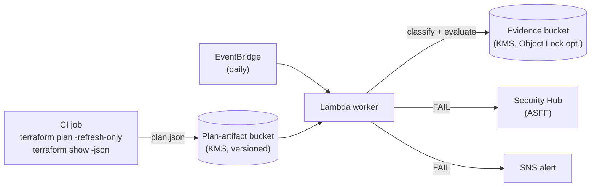

# Terraform State Drift Detection & Remediation Governance

## Problem

Infrastructure managed by Terraform drifts when someone changes a cloud
resource outside the Terraform workflow — a console edit, an incident-response
script, another tool. The declared baseline and reality diverge silently, and
the next `terraform apply` may revert a needed emergency fix or, worse, mask a
malicious change. This lab detects that drift, classifies it by severity, and
produces auditor-grade evidence.

## Why this matters

| Dimension | Detail |
|-----------|--------|
| Primary risk | Out-of-band changes break the Terraform baseline and evade change control |
| Likelihood × Impact | High × High (see [RISK.md](./RISK.md)) |
| Control theme | Enforce intended state (KSI-CNA-EIS); redeploy from version control, not direct modification (KSI-CMT-RMV) |

## Architecture



Terraform itself runs in CI (it needs its binary and cloud credentials); the
Lambda **evaluates** the plan artifact and emits compliance evidence. This
split keeps the function least-privilege — it only reads plan JSON and writes
evidence.

## Services

AWS Lambda · EventBridge · S3 (plan-artifact input + evidence output) · KMS ·
SNS · SQS (DLQ) · Security Hub · CloudWatch Logs. Producer side: any Terraform
CI runner.

## SCF controls & FedRAMP 20x KSIs

| SCF | Title | KSI |
|-----|-------|-----|
| CFG-01 | Configuration Management Program | KSI-CNA-EIS |
| CFG-02 | Secure Baseline Configurations | KSI-CNA-EIS |
| CPL-01 | Statutory, Regulatory & Contractual Compliance | KSI-MLA-EVC |
| MON-01 | Continuous Monitoring | KSI-AFR-PVL |
| CHG-02 | Configuration Change Control | KSI-CMT-RMV |

Crosswalk: [`scf/scf-mapping.generated.json`](./scf/scf-mapping.generated.json);
assessment procedures: [`ASSESSMENT.md`](./ASSESSMENT.md).

## Drift model (borrowed from tfdrift)

Severity classification, the ignore-file approach, and plan parsing follow the
[tfdrift](https://github.com/sudarshan8417/tfdrift) tool, adapted to this
portfolio's evidence contract:

- **Severity** — `critical` (security-group ingress/egress, IAM/bucket/KMS
  policy), `high` (deletes, IAM roles/users, instance type, public
  accessibility), `low` (tags/description), `medium` (everything else).
- **Ignore list** — `DRIFT_IGNORE` takes `.tfdriftignore`-style glob patterns
  (e.g. `aws_autoscaling_group.*.desired_capacity`, `*.tags.LastModified`) so
  expected drift does not fail the check.
- **Threshold** — `FAIL_SEVERITY` (default `high`): drift at or above it fails.

## Lab layout

```
16-terraform-drift-detection/
  README.md  RISK.md  SPEC.md  ASSESSMENT.md
  scf/            lab-spec.json, scf-mapping.generated.json, oscal-component.json
  infrastructure/ template.yaml (hardened SAM)
  src/            handler.py, lab_common.py (vendored)
  tests/          test_handler.py
```

## Quick start

```bash
# Offline behavior demo (no AWS calls):
python3 -c "import sys; sys.path.insert(0,'src'); import handler; \
  class C: invoked_function_arn='arn:aws:lambda:us-east-1:123456789012:function:x'; aws_request_id='r'; \
  print(handler.handler({'mode':'simulation'}, C(), s3_client=type('S',(),{'put_object':lambda **k:None})()))"

# Deploy (packages the real handler):
sam build -t infrastructure/template.yaml
sam deploy --guided

# Producer side (CI), writing a plan artifact the worker reads:
terraform plan -refresh-only -out tfplan
terraform show -json tfplan > plan.json
aws s3 cp plan.json "s3://$PLAN_BUCKET/prod/plan.json" --sse aws:kms
```

## Related labs

- [`04-config-drift-compliance`](../04-config-drift-compliance/) — the same
  drift problem from the AWS Config angle (agentless, provider-native).
- [`15-immutable-cicd-change-control`](../15-immutable-cicd-change-control/) —
  the change-control plane that drift violates (KSI-CMT-RMV).

> **Note:** unlike the other labs, this one ships no `index.html` walkthrough
> or `.tldr` diagram — the architecture is the mermaid diagram above, and
> `scf/scf-mapping.generated.json` is the canonical crosswalk.
