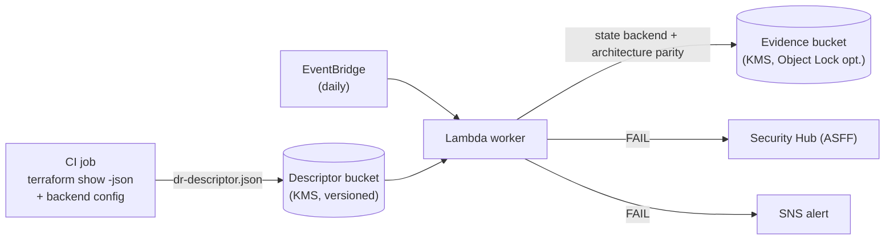

# Terraform DR Readiness & State-Backend Resilience

## Problem

Disaster recovery for Terraform-managed systems has two IaC-specific failure
modes that runtime backup checks miss:

1. **The state backend is a single point of failure for recovery.** You recover
   by re-applying Terraform — but if state lives in a local file, or in an S3
   backend without versioning, encryption, cross-region replication, and
   locking, a region or backend loss takes your *ability to recover* with it.
2. **The code may not encode the DR posture the RTO/RPO demands** — no
   designated recovery region, critical data stores without cross-region
   durability, no failover routing.

This lab evaluates a DR-readiness descriptor derived from Terraform and proves,
with assessor-ready evidence, that recovery-by-reapply is actually possible.

## Why this matters

| Dimension | Detail |
|-----------|--------|
| Primary risk | A disaster is unrecoverable because the IaC control plane or the declared architecture isn't DR-ready |
| Likelihood × Impact | Medium × Critical (see [RISK.md](./RISK.md)) |
| Control theme | Align recovery plan/backups with objectives (KSI-RPL-ARP/ABO/RRO); optimize for rapid recovery (KSI-CNA-OFA); enforce intended state (KSI-CNA-EIS) |

## Not a duplicate of lab 12

[`12-backup-recovery-rto-rpo`](../12-backup-recovery-rto-rpo/) evaluates the
**runtime** side — AWS Backup objectives and restore-drill outcomes from the
live API. This lab evaluates the **IaC** side — whether the Terraform *code* and
its *state backend* make recovery possible in the first place. They are
complementary: this proves recovery is designed-in; lab 12 proves it was tested.

## Architecture



## What it checks

**State-backend resilience** (the IaC control plane — CFG-01 / KSI-CNA-EIS):
remote+locking backend (local backend is critical), state bucket versioning,
KMS encryption, and cross-region replication.

**DR architecture parity** (BCD family / KSI-RPL-*):
a designated recovery region distinct from primary; every critical data store
cross-region durable (replication, or PITR + cross-region backup); failover
routing (severity scales with the RTO target); and declared RTO/RPO vs the
DR-plan targets (`RTO_TARGET_MINUTES` / `RPO_TARGET_MINUTES`).

Findings above `FAIL_SEVERITY` (default `high`) fail the check. Unconfigured
input → `CONFIG_ERROR` (never a false PASS).

## Assessor-ready evidence (assurance case)

Like lab 16, each run emits provenance (bound to `terraform_commit` and
workspace), a recomputable SHA-256 integrity manifest, and a per-control
objective→claim→status mapping to the real NIST 800-53 rev 5 CP-family and
800-171 rev 3 objectives — `SATISFIED` / `OTHER-THAN-SATISFIED`. Governance
companions:

| File | Purpose |
|------|---------|
| [`governance/dr-plan.yaml`](./governance/dr-plan.yaml) | Approved DR plan / ODP register: RTO/RPO targets, recovery region, critical-asset scope |
| [`governance/derive-descriptor.sh`](./governance/derive-descriptor.sh) | Producer-side, **read-only** deriver that builds the DR descriptor from `terraform show -json` + the backend config, with a SHA-256 manifest |
| [`governance/policy/dr.rego`](./governance/policy/dr.rego) | OPA/Conftest gate on the emitted evidence, each violation objective-linked |

## Lab layout

```
17-terraform-dr-readiness/
  README.md  RISK.md  SPEC.md  ASSESSMENT.md
  scf/            lab-spec.json, scf-mapping.generated.json, oscal-component.json
  governance/     dr-plan.yaml, derive-descriptor.sh, policy/dr.rego
  infrastructure/ template.yaml (hardened SAM)
  src/            handler.py, lab_common.py (vendored)
  tests/          test_handler.py
```

## Quick start

```bash
# Offline behavior demo (no AWS calls):
python3 -c "import sys; sys.path.insert(0,'src'); import handler; \
  class C: invoked_function_arn='arn:aws:lambda:us-east-1:123456789012:function:x'; aws_request_id='r'; \
  print(handler.handler({'mode':'simulation'}, C(), s3_client=type('S',(),{'put_object':lambda **k:None})()))"

# Deploy:
sam build -t infrastructure/template.yaml
sam deploy --guided     # RtoTargetMinutes / RpoTargetMinutes come from your DR plan

# Producer side (CI): derive and upload the descriptor
./governance/derive-descriptor.sh > dr-descriptor.json
aws s3 cp dr-descriptor.json "s3://$DESCRIPTOR_BUCKET/prod/dr.json" --sse aws:kms
```

## Related labs

- [`12-backup-recovery-rto-rpo`](../12-backup-recovery-rto-rpo/) — runtime AWS
  Backup RTO/RPO and restore-drill evidence (the complement to this lab).
- [`16-terraform-drift-detection`](../16-terraform-drift-detection/) — the same
  Terraform-plan evidence + assurance-case pattern, for out-of-band drift.

> **Note:** like lab 16, this lab ships no `index.html` walkthrough or `.tldr`
> diagram — the architecture is the mermaid diagram above, and
> `scf/scf-mapping.generated.json` is the canonical crosswalk.
